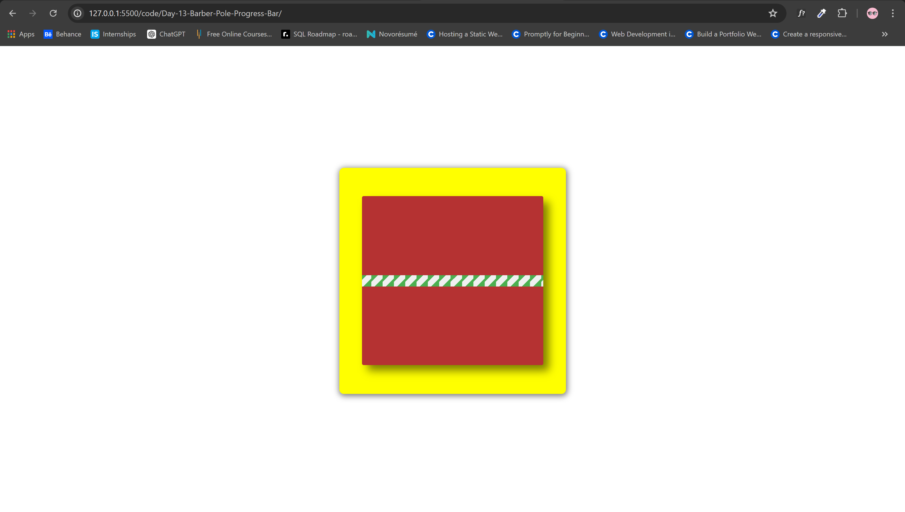

# Barber Pole Progress Bar

## Description

This challenge demonstrates how to create an animated barber pole progress bar using HTML and CSS. The barber pole progress bar features a classic rotating striped effect that can be used to indicate progress in a visually engaging manner.

## Features

- Animated barber pole effect using CSS animations.
- Centered layout using flexbox for modern, responsive design.
- Easy to integrate and customize.

## Usage

### Prerequisites

- A modern web browser that supports CSS animations and flexbox.
- Basic knowledge of HTML and CSS.

### Instructions

1. **Clone or Download the Project:**
   - Clone the repository from GitHub or download the project files to your local machine.
    
     git clone https://github.com/Yashi-Singh-1/Day-13-Barber-Pole-Progress-Bar.git
    
   - Or download the ZIP file from the [GitHub repository](https://github.com/Yashi-Singh-1/Day-13-Barber-Pole-Progress-Bar).

2. **Open the Project:**
   - Navigate to the project directory and open the index.html file in your preferred web browser.

3. **Customization:**
   - You can customize the colors, sizes, and animation speed by editing the CSS in the <style> section of the HTML file.

### Preview

### Example Use Cases

- Loading indicators for web applications.
- Progress bars for form submissions or data uploads.
- Visual feedback for processing tasks.

